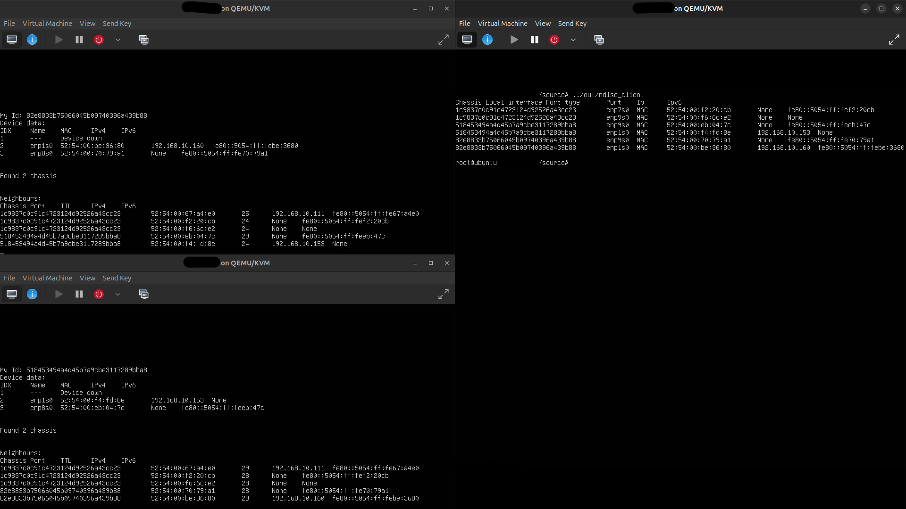
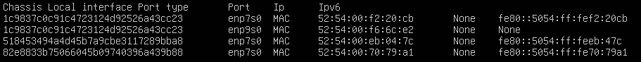

# Neighbour discovery service (ndisc)

This repository contains a neighbour discovery service (`ndisc`) and a client (`ndisc_client`)

Neighbours are able to communicate their mac, ipv4 and ipv6 addresses to other devices.

Service instances acquire system information via Netlink, communicate this via LLDP frames and
relay neighbour data via a simple custom protocol based on sequential packets.

`ndisc` requires at least `CAP_NET_RAW` and full access to the `/run/ndisc/` directory to function.

`ndisc` can be run with `-v` to display device status and found neighbours, providing more information than `ndisc_client` can provide.

`ndisc_client` can be run by itself to display neighbour data once, or with `-c` to run continuously. In conjunction with `-c`, `-t` followed by
a number can specify the fetch interval in seconds.

Each display instance is in a TSV format with the neighbour's chassis, port, ip addresses and device name, from which the neighbour was reachable.

# Test example

3 virtual machines are connected via 2 virtual bridges.

`ndisc` is run on all 3 machines. For completeness of the testing environment, a DHCP server is running on one of the bridges, providing ipv4 addresses to devices that are connected.

The service responds to devices gaining or losing ip addresses, and dynamically changing devices.

Device enp1s0 got taken down while the services are still active. 